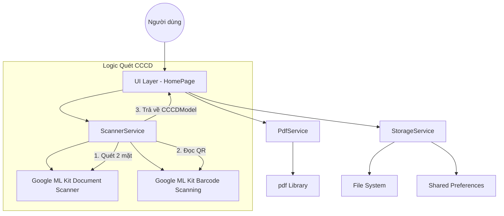

# Kiến trúc Hệ thống Scanner Vision 🏗️

Scanner Vision được thiết kế theo kiến trúc phân lớp nhằm chia tách trách nhiệm (Separation of Concerns), giúp mã nguồn dễ bảo trì và mở rộng.

## 📐 Tổng quan kiến trúc

Ứng dụng tuân thủ mô hình 3 lớp cơ bản:

1.  **UI Layer (Presentation)**: Các Flutter Widgets và Pages (Material 3). Đảm nhận việc hiển thị và tương tác với người dùng.
2.  **Service Layer (Business Logic)**: Các lớp Service chuyên biệt xử lý logic nghiệp vụ.
3.  **Infrastructure Layer (Data/External)**: ML Kit SDK, PDF Library, SharedPreferences và File System.

## 🔄 Luồng dữ liệu chính

## 🧩 Các thành phần cốt lõi

### 1. ScannerService
Chịu trách nhiệm tương tác với Google ML Kit.
- **Document Scanning**: Sử dụng `ScannerMode.full` để tự động phát hiện cạnh.
- **CCCD Scanning**: Kết hợp giữa việc quét ảnh và quét barcode (QR code) để trích xuất dữ liệu định danh đồng bộ với hình ảnh.

### 2. PdfService
Thành phần then chốt trong việc tạo ra tệp PDF chất lượng cao.
- **Orientation Control**: Tự động phát hiện hướng ảnh (Ngang/Dọc) để thiết lập khổ giấy PDF tương ứng.
- **Smart Scaling**: Sử dụng thuật toán tính toán tỷ lệ (scale) dựa trên kích thước thật của ảnh (`decodeImageFromList`) để đảm bảo ảnh khớp hoàn toàn với trang A4 mà không bị cắt xén (Crop).

### 3. StorageService
Quản lý việc lưu trữ tệp tin và các phiên làm việc (Sessions).
- Lưu trữ ảnh tạm thời và ảnh chính thức trong thư mục tài liệu của ứng dụng.
- Quản lý danh sách các `ScanSession` để người dùng có thể xem lại lịch sử.

### 4. SettingsService
Quản lý cấu hình ứng dụng thông qua `shared_preferences`.
- Bật/tắt chế độ xem trước khi in.
- Cấu hình đường dẫn lưu trữ mặc định.

## 📄 Định dạng dữ liệu

- **Ảnh**: JPEG (nén để tiết kiệm dung lượng).
- **Tài liệu**: PDF (tiêu chuẩn A4).
- **Thông tin CCCD**: JSON (được đóng gói trong `CCCDModel`).

---
> [!NOTE]
> Ứng dụng ưu tiên xử lý Offline trên thiết bị để đảm bảo quyền riêng tư và tốc độ xử lý tối đa.
