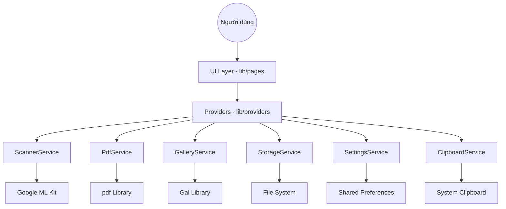

# Kiến trúc Hệ thống Scanner Vision 🏗️

Scanner Vision được thiết kế theo kiến trúc phân lớp nhằm chia tách trách nhiệm (Separation of Concerns), giúp mã nguồn dễ bảo trì và mở rộng.

## 📐 Tổng quan kiến trúc

Ứng dụng tuân thủ mô hình 3 lớp cơ bản:

1.  **UI Layer (Presentation)**: Các Flutter Widgets và Pages (Material 3) trong `lib/pages/`.
2.  **State Management Layer**: Sử dụng `Provider` để quản lý trạng thái tập trung (`lib/providers/`):
    - `SettingsProvider`: Quản lý cấu hình người dùng.
    - `SessionProvider`: Quản lý danh sách các phiên quét.
3.  **Service Layer (Business Logic)**: Các lớp Service chuyên biệt trong `lib/services/`.
4.  **Infrastructure Layer (Data/External)**: ML Kit SDK, PDF Library, SharedPreferences, File System, Gal (Gallery).

## 🔄 Luồng dữ liệu chính

## 🧩 Các thành phần cốt lõi

### 1. ScannerService
Chịu trách nhiệm tương tác với Google ML Kit.
- **Document Scanning**: Sử dụng `ScannerMode.full` để tự động phát hiện cạnh.
- **CCCD Scanning**: Kết hợp giữa việc quét ảnh và quét barcode (QR code) để trích xuất dữ liệu định danh đồng bộ với hình ảnh.

### 2. PdfService
Thành phần then chốt trong việc tạo ra và quản lý tệp PDF.
- **Orientation Control**: Hỗ trợ xuất PDF theo cả hướng Dọc (Portrait) và Ngang (Landscape).
- **Automation Flow**: 
    - Tự động lưu vào thư mục `Pictures/Scanner Vision`.
    - Tự động sao chép đường dẫn file vào Clipboard (tùy chọn trong Cài đặt).
    - Tự động mở file ngay sau khi lưu để người dùng kiểm tra hoặc in.

### 3. GalleryService
Quản lý việc tương tác với thư viện ảnh của hệ thống.
- **Auto-save**: Tự động lưu ảnh đã quét vào Photos/Gallery nếu được bật trong cài đặt.
- **Permission Handling**: Xử lý yêu cầu quyền truy cập ảnh trên Android/iOS một cách mượt mà.

### 4. StorageService
Quản lý việc lưu trữ tệp tin và các phiên làm việc (Sessions).
- **Persistent Storage**: Di chuyển ảnh từ thư mục tạm sang thư mục Documents của ứng dụng.
- **Session Management**: Quản lý danh sách `ScanSession` (ID, Ngày, Loại, Dữ liệu CCCD, Danh sách ảnh).

### 5. SettingsService & Provider
Quản lý cấu hình ứng dụng thông qua `shared_preferences`.
- **User Toggles**: Bật/tắt tự động lưu gallery, tự động copy clipboard (ảnh/đường dẫn PDF), xem trước in.
- **Persistence**: Đảm bảo các lựa chọn của người dùng được lưu lại cho các lần sử dụng sau.

### 6. ClipboardService
Cung cấp khả năng tương tác với Clipboard của hệ thống.
- **Binary Support**: Sử dụng `pasteboard` để sao chép dữ liệu hình ảnh (Binary) trực tiếp.
- **Automation**: Tự động sao chép ảnh hoặc đường dẫn PDF ngay sau khi có kết quả, tối ưu hóa quy trình làm việc.

## 📄 Định dạng dữ liệu

- **Ảnh**: JPEG (nén tối ưu).
- **Tài liệu**: PDF (tiêu chuẩn A4).
- **Thông tin CCCD**: JSON (được đóng gói trong `CCCDModel`).

---
> [!NOTE]
> Ứng dụng ưu tiên xử lý Offline trên thiết bị để đảm bảo quyền riêng tư và tốc độ xử lý tối đa.
