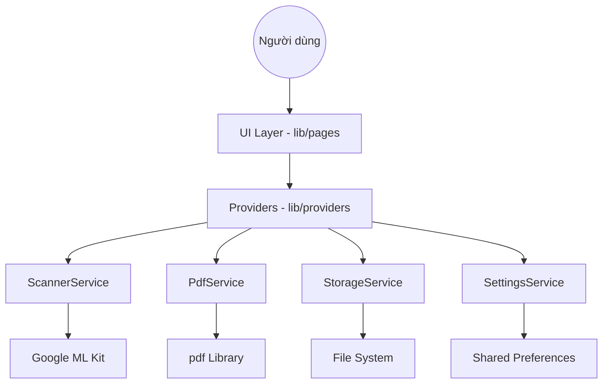

# Kiến trúc Hệ thống Scanner Vision 🏗️

Scanner Vision được thiết kế theo kiến trúc phân lớp nhằm chia tách trách nhiệm (Separation of Concerns), giúp mã nguồn dễ bảo trì và mở rộng.

## 📐 Tổng quan kiến trúc

Ứng dụng tuân thủ mô hình 3 lớp cơ bản:

1.  **UI Layer (Presentation)**: Các Flutter Widgets và Pages (Material 3) trong `lib/pages/`.
2.  **State Management Layer**: Sử dụng `Provider` để quản lý trạng thái tập trung (`lib/providers/`).
3.  **Service Layer (Business Logic)**: Các lớp Service chuyên biệt trong `lib/services/`.
4.  **Infrastructure Layer (Data/External)**: ML Kit SDK, PDF Library, SharedPreferences, File System.

## 🔄 Luồng dữ liệu chính

## 🧩 Các thành phần cốt lõi

### 1. ScannerService
Chịu trách nhiệm tương tác với Google ML Kit.
- **Document Scanning**: Sử dụng `ScannerMode.full` để tự động phát hiện cạnh.
- **CCCD Scanning**: Kết hợp giữa việc quét ảnh và quét barcode (QR code) để trích xuất dữ liệu định danh đồng bộ với hình ảnh.

### 2. PdfService
Thành phần then chốt trong việc tạo ra và quản lý tệp PDF.
- **Orientation Control**: Hỗ trợ xuất PDF theo cả hướng Dọc (Portrait) và Ngang (Landscape), đặc biệt hữu ích cho việc ghép mặt CCCD.
- **Smart Scaling**: Thuật toán Fit-to-page đảm bảo ảnh khớp hoàn toàn với trang A4 mà không bị cắt xén.
- **Automation Flow**: 
    - Tự động lưu vào thư mục `Pictures/Scanner Vision`.
    - Tự động sao chép đường dẫn file vào Clipboard.
    - Tự động mở file ngay sau khi lưu để người dùng kiểm tra hoặc in.

### 3. StorageService
Quản lý việc lưu trữ tệp tin và các phiên làm việc (Sessions).
- **Persistent Storage**: Di chuyển ảnh từ thư mục tạm (Cache) sang thư mục tài liệu lâu dài của ứng dụng khi người dùng nhấn "Lưu vào lịch sử".
- **Session Management**: Quản lý danh sách `ScanSession` (ID, Ngày, Loại, Dữ liệu CCCD, Danh sách ảnh).
- **Data Integrity**: Đảm bảo tệp tin ảnh và dữ liệu JSON luôn đồng bộ khi thêm/xóa phiên quét.

### 4. SettingsService
Quản lý cấu hình ứng dụng thông qua `shared_preferences`.
- Bật/tắt chế độ xem trước khi in.
- Cấu hình đường dẫn lưu trữ mặc định.

## 📄 Định dạng dữ liệu

- **Ảnh**: JPEG (nén để tiết kiệm dung lượng).
- **Tài liệu**: PDF (tiêu chuẩn A4).
- **Thông tin CCCD**: JSON (được đóng gói trong `CCCDModel`).

---
> [!NOTE]
> Ứng dụng ưu tiên xử lý Offline trên thiết bị để đảm bảo quyền riêng tư và tốc độ xử lý tối đa.
